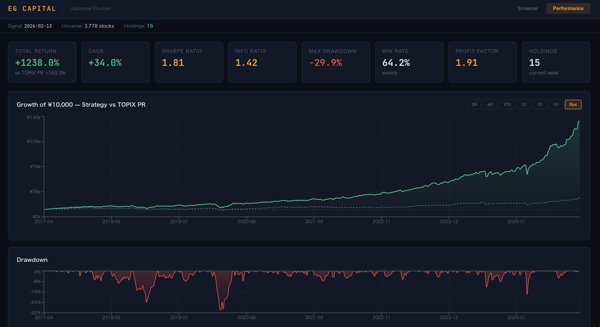
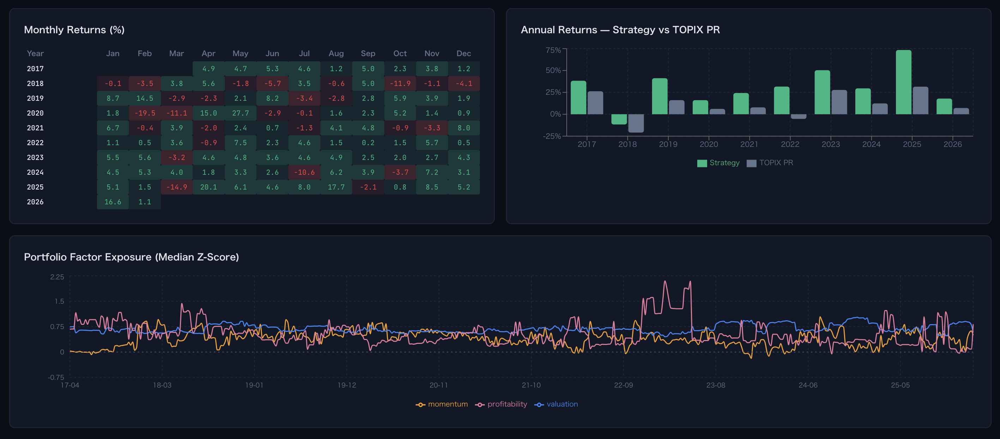
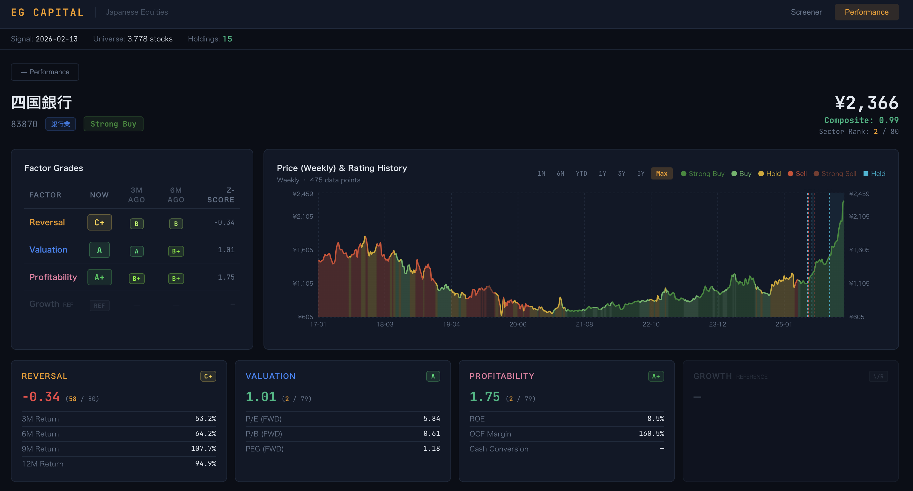
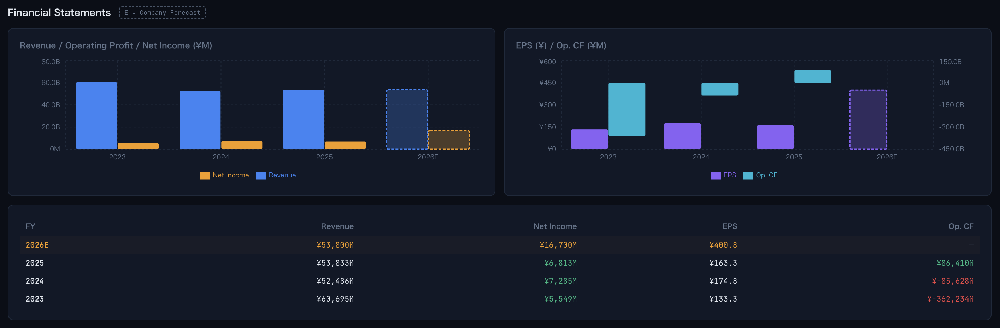

# Japanese Equity Factor Model — GARP Strategy

A systematic, long-only multi-factor strategy for Japanese equities, built from the ground up: data pipeline, factor research, backtesting engine, portfolio construction, and a live monitoring dashboard.

**Live trading since 2026. All results below are out-of-sample validated.**

---

## Performance (2017-04 ~ 2026-02, ~8.8 years)

| Metric | Strategy | TOPIX |
|---|---|---|
| **Total Return** | **+1,223%** | +156% |
| **CAGR** | **33.7%** | — |
| **Sharpe Ratio** | **1.79** | — |
| **Information Ratio** | **1.42** | — |
| **Max Drawdown** | -29.9% | — |
| **Avg Weekly Turnover** | ~30% | — |

> Strategy returns are gross of transaction costs. Universe: ~3,800 TSE-listed stocks (Prime, Standard, Growth), excluding REITs and ETFs.

---

## Dashboard


*Performance overview — KPI cards, cumulative return vs TOPIX, and drawdown analysis*


*Monthly return heatmap, annual returns comparison, and portfolio factor exposure over time*


*Individual stock profile — factor grades with historical tracking, price chart with rating overlay*


*Company financials — Revenue, Net Income, EPS, and Operating Cash Flow with forward estimates*

---

## Methodology

### Universe & Rebalance
- All TSE-listed equities (Prime, Standard, Growth markets)
- REITs and ETFs excluded
- Weekly rebalance cycle: Friday signal → Monday open execution

### Factor Model
The composite score combines three factor categories using sector-neutral Z-scores, calculated within 33 TSE sector peer groups to avoid cross-sector bias:

- **Valuation** — Forward P/E, P/B, PEG
- **Profitability** — ROE, Operating Cash Flow Margin, Cash Conversion
- **Momentum** — 3M, 6M, 9M, 12M price performance (inverted — contrarian tilt)

A fourth category, **Growth**, was systematically tested but excluded from the composite after validation showed inconsistent predictive power. It is retained as a reference indicator.

### Portfolio Construction
- Concentrated portfolio (~15 stocks) selected from the highest-scoring quintile
- Sector-neutral scoring prevents sector concentration
- Drawdown control via price-based losscut with permanent blacklist

### Key Design Decisions
- **Concentration > Diversification**: Top-quintile concentration significantly outperforms diversified alternatives
- **No look-ahead bias**: Forward returns use T+1 week prices for T week signals
- **Friday-complete weeks only**: Weekly aggregation cross-references calendar data with actual trading days

---

## Architecture

```
J-Quants API → Data Pipeline → Factor Construction → Composite Scoring
                                                          ↓
                              Dashboard (React) ← JSON ← Portfolio Engine
```

| Component | Description |
|---|---|
| **Data Pipeline** | Incremental update scripts, raw → master parquet conversion, validation |
| **Factor Research** | 10 Jupyter notebooks covering individual factor analysis and validation |
| **Backtesting Engine** | Stateful portfolio simulation with losscut, blacklist, and turnover tracking |
| **Dashboard** | React + Vite app with interactive charts, stock screener, and financial statements |
| **Converter** | YAML-configured pipeline transforming backtest outputs to dashboard JSON |

---

## Factor Validation

Each factor underwent rigorous quintile spread analysis across the full backtest period:

- **Valuation factors** show strong monotonic Q1→Q5 spread (top quintile outperforms bottom by ~16% annually)
- **Profitability factors** provide meaningful but moderate differentiation
- **Momentum factors** exhibit clear inverse relationship — low recent momentum combined with strong fundamentals identifies mean-reversion opportunities
- **Growth factors** showed no consistent spread, leading to their exclusion

Quintile regression p-values confirm monotonicity for all included factors.

---

## Tech Stack

- **Data**: J-Quants API, pandas, parquet, NumPy
- **Research**: Jupyter notebooks, matplotlib, seaborn, scipy, statsmodels
- **Dashboard**: React, Vite, JavaScript
- **Infrastructure**: Python scripts, YAML configuration, automated JSON pipeline

---

## Full Source Code

This public repository provides a methodology overview and performance results.

The complete source code — including the backtesting engine, factor construction pipeline, live trading signals, and dashboard — is maintained in a **private repository**. This is a live trading strategy and access is restricted to protect proprietary signals.

**If you would like to review the full codebase, please contact me with your GitHub username and I will grant temporary access.**

---

## Author

Built independently as both a research project and live trading system for Japanese equities.

